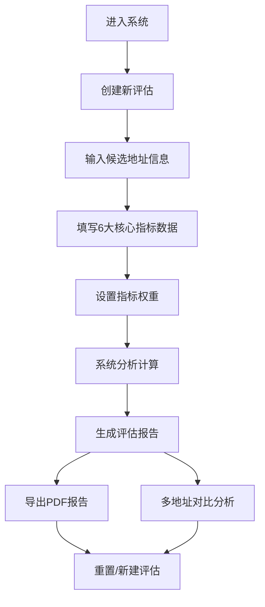

# 健身房选址评估系统产品文档

## 1. 产品概述

### 1.1 产品背景
随着健身行业的快速发展，健身房选址的重要性日益凸显。传统的选址评估依赖人工经验和零散数据，缺乏系统性和科学性。为解决这一问题，我们开发了健身房选址评估系统，通过数字化工具帮助投资者和运营商进行科学的选址决策。

### 1.2 产品目标
- 提供系统化的健身房选址评估框架，基于6大核心指标进行综合分析
- 简化选址评估流程，减少人工计算和主观判断
- 生成可视化的评估报告，辅助决策制定
- 提高选址成功率，降低投资风险

### 1.3 目标用户
- 健身房投资者
- 健身品牌运营商
- 商业地产顾问
- 健身行业创业者

## 2. 核心功能

### 2.1 功能模块

| 模块名称 | 功能描述 |
|---------|---------|
| 选址评估 | 基于7大核心指标进行系统化评估，支持自定义权重 |
| 数据录入 | 提供结构化表单，收集候选地址的各项指标数据 |
| 分析计算 | 自动计算各项指标得分，生成综合评估结果 |
| 可视化报告 | 生成图表化评估报告，展示各项指标得分和综合排名 |
| 对比分析 | 支持多个候选地址的对比分析，直观展示优劣 |
| 数据管理 | 保存历史评估记录，支持数据导出和分享 |

### 2.2 核心流程



## 3. 页面设计

### 3.1 整体布局
- **顶部标题栏**：系统名称、PDF导出按钮、重置按钮
- **主内容区**：单页面滚动布局，包含所有功能模块
  - 地址信息输入
  - 6大核心指标评估表单
  - 权重设置
  - 评估结果展示
  - 多地址对比分析
- **底部信息**：版权信息、使用说明

### 3.2 页面详情

| 模块名称 | UI元素 |
|---------|--------|
| 地址信息 | 地址输入框、地图选择器、周边环境描述 |
| 指标评估表 | 6大核心指标的详细评分表，包含输入框、滑块、下拉选择器 |
| 权重设置 | 可拖动的权重调整滑块，实时显示权重百分比 |
| 评估结果 | 大型评分仪表盘，显示综合得分和等级 |
| 指标分析 | 雷达图展示6大指标得分，柱状图展示各项子指标得分 |
| 详细分析 | 文字化的详细分析结果，包含优势和劣势 |
| 对比分析 | 表格形式展示多个候选地址的各项指标得分和排名 |
| 导出功能 | PDF导出按钮，支持将评估结果导出为PDF文件 |

## 4. 核心功能详细设计

### 4.1 选址评估模块

#### 4.1.1 目标客群与人口密度评估
- **功能点**：
  - 3公里内目标人群数量及占比输入
  - 年轻人口占比计算
  - 周边写字楼、高校、社区分布情况
  - 周边健康消费场所数量统计
- **UI设计**：
  - 数字输入框
  - 下拉选择器
  - 地图标记功能
  - 实时计算结果展示

#### 4.1.2 交通与可达性评估
- **功能点**：
  - 步行可达性分析
  - 公共交通便利度评估
  - 停车便利性评估
- **UI设计**：
  - 距离输入框
  - 单选/多选框
  - 地图距离测量工具

#### 4.1.3 人流与曝光度评估
- **功能点**：
  - 门前道路车流量、人流量统计
  - 门面曝光度评估
  - 自然引流潜力分析
- **UI设计**：
  - 数字输入框
  - 照片上传功能
  - 场景选择器

#### 4.1.4 建筑硬件与空间结构评估
- **功能点**：
  - 楼层与层高分析
  - 承重能力评估
  - 面积与布局规划
  - 水电与通风条件评估
- **UI设计**：
  - 数字输入框
  - 下拉选择器
  - 平面图上传功能

#### 4.1.5 竞争与市场饱和度评估
- **功能点**：
  - 周边同类健身房数量统计
  - 替代性运动场所分析
  - 市场饱和度判断
- **UI设计**：
  - 数字输入框
  - 地图标记功能
  - 热力图展示

#### 4.1.7 合规与安全评估
- **功能点**：
  - 消防合规性评估
  - 卫生与安全条件评估
  - 噪音与扰民风险分析
- **UI设计**：
  - 单选/多选框
  - 上传功能
  - 风险等级指示器

### 4.2 分析计算模块

#### 4.2.1 得分计算
- **功能点**：
  - 基于预设公式计算各项指标得分
  - 支持自定义权重调整
  - 实时更新综合得分
- **算法设计**：
  - 单项指标得分 = 实际值 / 标准值 × 100
  - 综合得分 = Σ(单项指标得分 × 权重)
  - 评估等级：≥80分（优秀）、60-79分（良好）、＜60分（不推荐）

#### 4.2.2 报告生成
- **功能点**：
  - 生成可视化评估报告
  - 支持PDF导出
  - 支持分享链接
- **报告内容**：
  - 综合评分与等级
  - 各项指标详细得分
  - 优势与劣势分析
  - 改进建议
  - 投资风险评估

## 5. 用户流程

### 5.1 新用户流程
1. 访问系统登录页
2. 注册新账号
3. 登录系统
4. 浏览系统引导页
5. 创建新的选址评估
6. 填写候选地址信息
7. 完成6大核心指标评估
8. 查看评估报告
9. 导出或分享报告

### 5.2 老用户流程
1. 登录系统
2. 从仪表盘进入评估模块
3. 创建新评估或查看历史记录
4. 完成评估流程
5. 查看或导出报告
6. 进行多地址对比分析

## 6. 技术架构

### 6.1 前端技术栈
- HTML5 + CSS3 + JavaScript
- Bootstrap 5（响应式布局）
- Chart.js（数据可视化）
- Leaflet.js（地图功能）
- jQuery（DOM操作）

### 6.2 数据存储
- 本地存储（localStorage）：保存用户设置和临时数据
- 浏览器数据库（IndexedDB）：存储评估记录和报告
- 可选：后端服务器存储（如需多设备同步）

### 6.3 核心技术点
- 响应式设计：适配不同设备屏幕
- 数据可视化：图表展示评估结果
- 表单验证：确保数据输入的准确性
- 本地存储：实现离线功能
- 模块化开发：提高代码可维护性

## 7. 数据模型

### 7.1 核心数据结构

#### 7.1.1 选址评估记录
```javascript
{
  id: "unique-id",
  name: "候选地址名称",
  address: "详细地址",
  coordinates: {lat: 39.9042, lng: 116.4074},
  createdAt: "2026-02-03T10:00:00",
  updatedAt: "2026-02-03T12:00:00",
  indicators: {
    targetAudience: {
      youngPopulationRatio: 0.45,
      highIncomeRatio: 0.35,
      nearbyOffices: 3,
      nearbyUniversities: 1,
      nearbyCommunities: 5,
      healthBusinesses: 8,
      score: 85
    },
    transportation: {
      walkingTime: 10,
      mainRoadFrontage: 12,
      metroDistance: 300,
      busRoutes: 5,
      parkingSpaces: 10,
      score: 90
    },
    footTraffic: {
      carFlow: 2000,
      pedestrianFlow: 1500,
      exposureLevel: 0.8,
      score: 75
    },
    buildingStructure: {
      floor: 2,
      ceilingHeight: 4.2,
      bearingCapacity: 500,
      area: 600,
      powerCapacity: 150,
      ventilation: 45,
      score: 80
    },
    competition: {
      nearbyGyms: 2,
      alternativePlaces: 3,
      marketSaturation: 0.6,
      score: 70
    },

    compliance: {
      fireSafety: true,
      healthConditions: true,
      noiseControl: true,
      score: 90
    }
  },
  weights: {
    targetAudience: 0.15,
    transportation: 0.15,
    footTraffic: 0.15,
    buildingStructure: 0.2,
    competition: 0.1,
    compliance: 0.1
  },
  totalScore: 82.5,
  level: "优秀",
  report: {
    strengths: ["交通便利", "建筑结构合理"],
    weaknesses: ["人流密度一般", "竞争略激烈"],
    suggestions: ["加强营销推广", "优化服务差异化"]
  }
}
```

## 8. 实现计划

### 8.1 开发阶段

| 阶段 | 时间 | 任务 |
|------|------|------|
| 需求分析 | 1周 | 详细分析用户需求，确定功能优先级 |
| 原型设计 | 1周 | 设计页面原型，确定UI风格和交互流程 |
| 前端开发 | 3周 | 实现页面布局、表单控件和基础功能 |
| 功能开发 | 2周 | 实现评估计算、报告生成和数据存储功能 |
| 测试优化 | 1周 | 进行功能测试和用户体验优化 |
| 部署上线 | 1周 | 部署到服务器，发布上线 |

### 8.2 里程碑
1. 完成产品原型设计
2. 实现核心评估功能
3. 完成报告生成功能
4. 系统测试通过
5. 正式上线

## 9. 市场推广策略

### 9.1 目标市场
- 健身行业投资者和运营商
- 商业地产中介和顾问
- 健身品牌扩张团队

### 9.2 推广渠道
- 行业协会合作
- 社交媒体营销
- 线下行业展会
- 定向邮件营销
- 合作伙伴推荐

### 9.3 商业模式
- 免费版：基础评估功能，支持3个评估记录
- 专业版：完整功能，无评估记录限制，高级分析工具
- 企业版：团队协作功能，定制化报告，API接口

## 10. 风险评估

### 10.1 潜在风险
- 数据准确性：用户输入数据的真实性和准确性
- 算法可靠性：评估算法的科学性和合理性
- 用户 adoption：用户习惯的改变和系统接受度
- 竞争风险：同类产品的出现和市场竞争

### 10.2 风险应对
- 数据验证：增加数据合理性检查和提示
- 算法优化：基于行业专家反馈持续改进算法
- 用户教育：提供详细的使用指南和案例示范
- 差异化竞争：持续迭代功能，提供独特价值

## 11. 结论

健身房选址评估系统是一款专为健身行业投资者和运营商设计的数字化工具，通过系统化的评估框架和直观的可视化报告，帮助用户做出科学的选址决策。系统基于6大核心指标进行综合分析，支持自定义权重调整，生成详细的评估报告，提高选址成功率，降低投资风险。

本产品采用纯前端技术实现，无需后端服务器，部署简单，使用便捷。通过响应式设计，适配不同设备屏幕，满足用户在不同场景下的使用需求。

随着健身行业的不断发展，健身房选址评估系统将成为行业标配工具，为健身行业的健康发展提供有力支持。